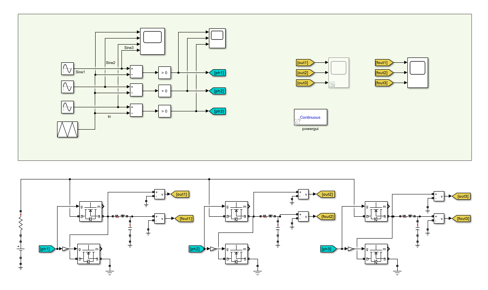
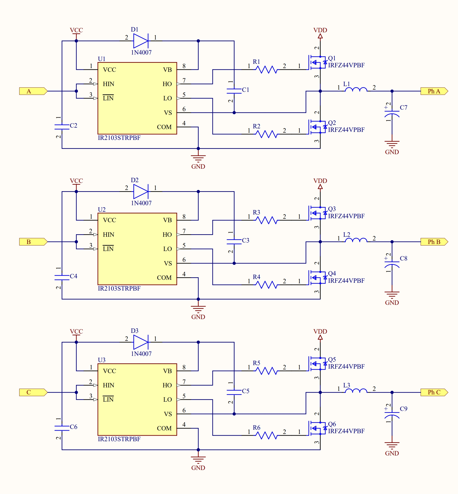
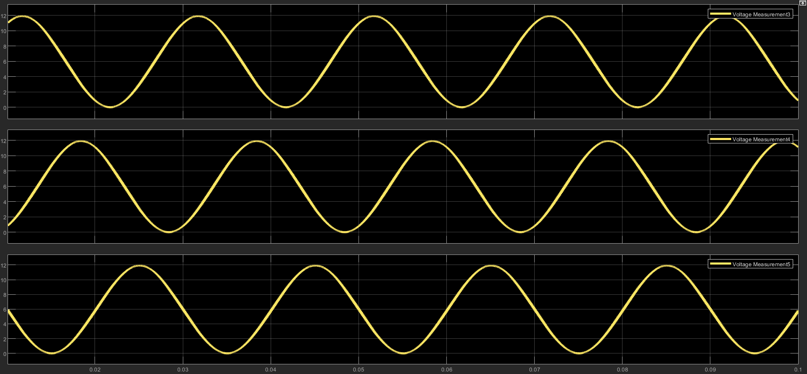
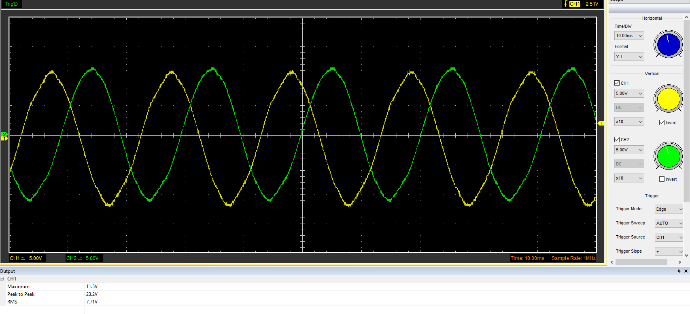

# ESPInverterCore
Three-phase inverter ( Simulink simulation + Hardware test with ESP32 )

# 3-Phase Inverter Project

This project focuses on the design and implementation of a 3-phase inverter. It includes a Simulink model for simulation to validate the inverter's performance, alongside a hardware implementation and circuit testing. The inverter is controlled using an ESP32 to generate 3-phase switching signals.

## Modulation Technique

The project employs the **Sinusoidal Pulse Width Modulation (SPWM)** technique. In SPWM, the width of the pulses is modulated according to a sinusoidal reference waveform for each phase. This method generates a stepped approximation of a sine wave, reducing harmonic distortion in the output voltage.

## Code Explanation

The ESP32 code leverages the **MCPWM (Motor Control PWM)** module to generate precise 3-phase switching signals. Below are the key components of the implementation:

- **Lookup Tables Calculation**:  
  Sine values for each phase, offset by 120 degrees, are precomputed in the `calc_sine_val` function (from `SineVal.h`). These values are calculated for half a grid cycle (e.g., 10 ms at 50 Hz), exploiting sine wave symmetry.

  

- **Variable Width PWM Implementation**:  
  The MCPWM timer operates in **up-down counting mode** at 25 kHz (derived from a 160 MHz clock and 3200-tick period), producing symmetric PWM signals. Comparators set the duty cycles, and generators output the PWM signals to GPIO pins driving the inverter switches. An **Interrupt Service Routine (ISR)**, marked with `IRAM_ATTR` for fast execution, triggers on the timer’s TEZ (Timer Event Zero) event, setting a flag to update duty cycles. A **FreeRTOS task**, pinned to core 1, checks this flag and updates the comparators with the next duty cycle values from the lookup table.

- **Dynamic Control**:  
  An analog input from GPIO34, read via `analogRead`, adjusts a `multiplier` (0 to 1), scaling the duty cycles to control the modulation index and thus the output voltage dynamically.

## Key Features

- **Efficient Lookup Tables**: Precomputing sine values optimizes performance.
- **MCPWM Utilization**: Precise PWM generation with dead-time and up-down mode configuration.
- **ISR Handling**: Time-critical updates via a high-priority interrupt routine.
- **FreeRTOS Multitasking**: Concurrent task execution on ESP32’s dual-core architecture.
- **Dynamic Modulation**: Real-time voltage control using analog input.
- **Logging**: Use of `ESP_LOGI` for effective debugging.

### line-voltages captured by osciloscope:

## Contributing

Contributions are welcome! Feel free to fork the repository and submit pull requests with enhancements or fixes.
